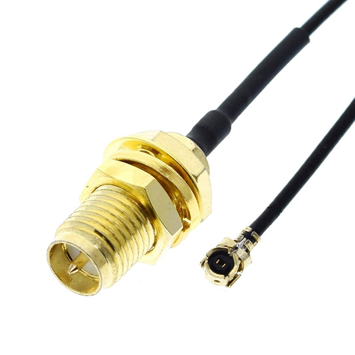
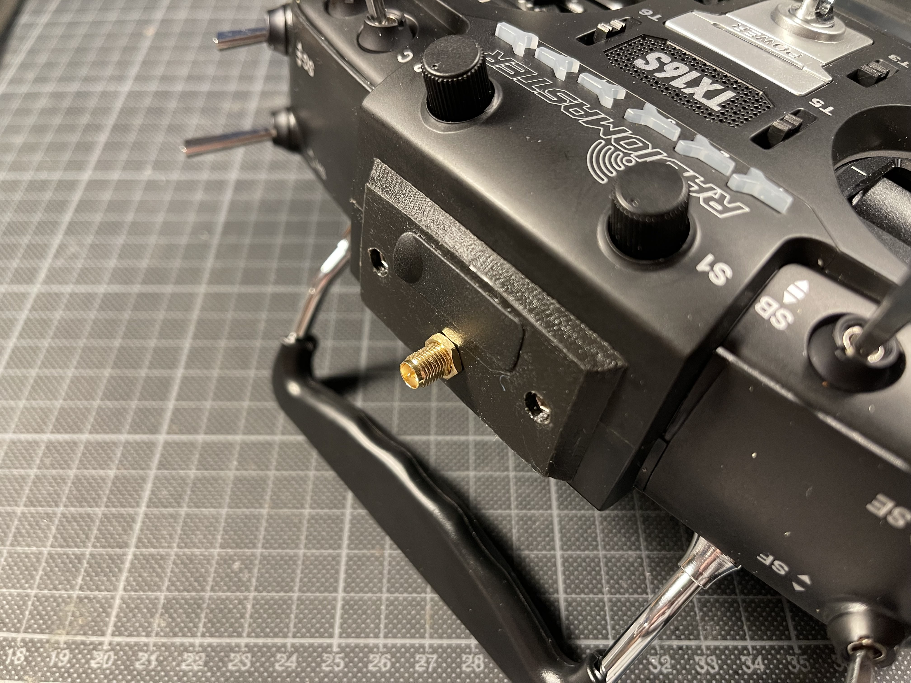
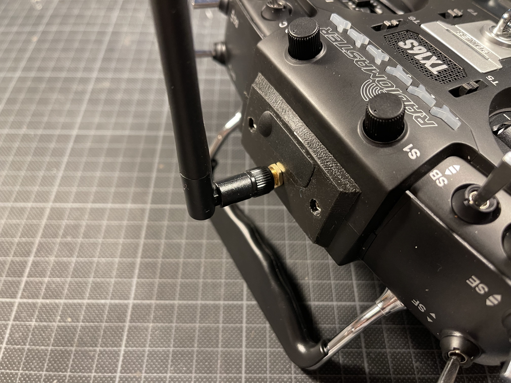

# RadioMaster TX16S : Removable Antenna Mod

_You know, for when you want to change your antenna_

## Why ?

The TX16S comes with a non-removable antenna. In most cases this is absolutely fine, but it can be useful to be able to change the antenna (for example if it breaks, if you want to install an antenna with a better gain, etc.).  
I modified the original antenna plate from Radiomaster ([available on Thingiverse](https://www.thingiverse.com/thing:4445962)) in order to accomodate a SMA connector. I also flattened a face on the 3D file to make 3D printing easier.

## How ?

If you want to use this mod, you'll have to find a U.FL to RP-SMA cable that you'll have to connect to the transceiver module of the TX16S. You can find such cables on your usual cheap electronics websites really easily.

Don't forget to re-use the port-protecting-flap-thingy from the original antenna plate on the new one (unless you don't want to protect the ports of course).

### Print settings :

> Note : This is only a suggestion of the print settings. Feel free to play around !

- Material : PLA  
- Extruder : 210°C (1st layer), 200°C (rest), 0.4mm  
- Bed : Ambient°C (I have no heated bed on my printer)  
- Layer height : 0.1mm  
- Infill : 100%  
- Supports : Yes, resolution of 1mm

The part can be oriented with the flat face (the visible face you can see on the pictures below) on the print bed.

## Pictures

U.FL <-> RP-SMA :  

New faceplate with RP-SMA connector :  

And with the antenna installed :  

